# Lab practice 1

This subsection is devoted to **lab practice 1**.

Lab practice 1 is about Use Case 13 of the [DeepHealth EU project](https://deephealth-project.eu)
based on the [CHB-MIT Scalp EEG Database](https://physionet.org/lightwave/?db=chbmit/1.0.0)

This database contains data from 24 patients, with several sessions per patient,
some sessions last 1 hour approximately, and others around 4 hours.

During each session, different channels are recorded, typically 21 or 23, each of them correspond to one or position in the scalp.
Each channel is recorded at a frequency of 256 Hz.

Next figure shows a snapshot of a 10-second recording of the channels, each channel has a different label to identify it.
More information about the meaning of the channels and how to work with them can be found in
the [same URL the database is accessible](https://physionet.org/lightwave/?db=chbmit/1.0.0)
and in some research papers, here you have two recent papers:

- [Epileptic Seizure Prediction With Multi-View Convolutional Neural Networks](docs/08910555.pdf)

- [Seizure Prediction in Scalp EEG Using 3D Convolutional Neural Networks With an Image-Based Approach](docs/08848612.pdf)

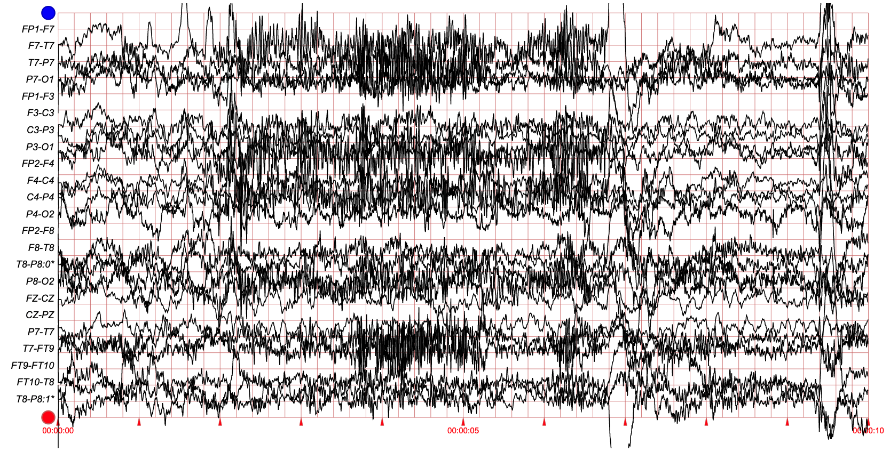

******

### Data preprocessing

The data preprocessing has been done following the typical **short-term analysis** also used for Speech recognition
and other signals.
This kind of analysis consists in assuming we are analysing a signal that contains information that do not change too fast,
that is, that for a short period of time the features we are interested to extract from the signal do not change.
In Speech recognition, the short-term considered period is of **20-25 ms**,
in the case of EEG signals, and due to the large amount of data in the dataset used here,
the period is **4 seconds**. In both cases, and in general, a sliding window is applied. Every **10 ms** for Speech recognition
and **2 seconds** in our case.

The analysis performed for each single extracted window consists in computing the **Discrete Fourier Transform (DFT)** to obtain
a distribution of the energy contained in the signal in the frequency domain,
followed by a **filter bank** to reduce the number of channels in frequency,
that, in turn, is followed by a the **Discrete Cosine Transform** to obtain
the [Cepstral Coefficients](https://en.wikipedia.org/wiki/Mel-frequency_cepstrum) and the energy.

As the DFT is sensible to sharp changes in the signal, that usually are represented by a high amount of harmonics, 
a smoothing window is required. The most widely window used for smoothing is the
[Hamming window](https://en.wikipedia.org/wiki/Window_function#Hamming_window).
Next figure shows the shape of the Hamming window:

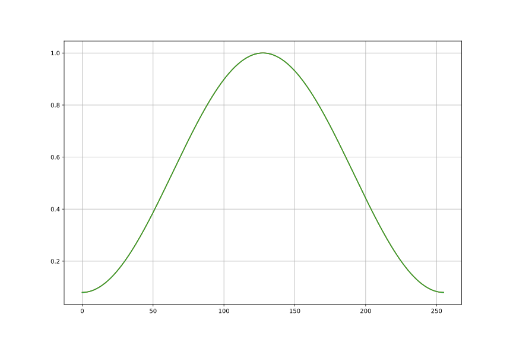

When the output of the DFT is available for each sliding window then a filter bank is applied.
Next figure shows the [Mel scale filter bank](https://en.wikipedia.org/wiki/Mel_scale),
the most widely used for Speech recognition.
This filter bank consists of a set of overlapping pass band filters of equal size with more resolution
on low frequencies than in high frequencies, trying to emulate the frequency discrimination our
[Cochlea](https://en.wikipedia.org/wiki/Cochlea).
For the case of EEG signals a linear instead of logarithmic filter bank is used, that is restricted to 
a specific band of frequencies.

Last step in the case of Speech recognition but no when processing EEG signals is to extract the 
[Cepstral Coefficients (CC)](https://en.wikipedia.org/wiki/Mel-frequency_cepstrum) and the energy.
In fact, the CC0 (first CC) can be considered the energy, but depending on the implementation the energy
can be computed from the raw signal in the time domain, i.e., from the waveform.

Next figure shows the first 5 filters to be applied on the output of the filter bank to obtain the
[Cepstral Coefficients (CC)](https://en.wikipedia.org/wiki/Mel-frequency_cepstrum).
Horizontal blue line constat at **1.0** is for computing the CC0, i.e., the sum of all the filters,
that is the total energy contained in the frequency domain for a given sliding window.

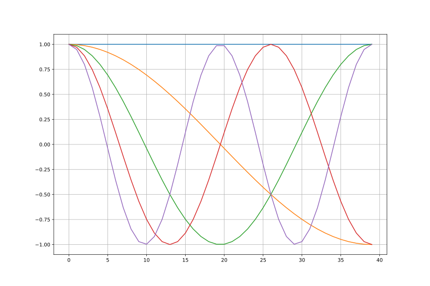

******

Next 21 figures contain a snapshot of 60 seconds (1 minute) of all the signals from the
session one of patient **CHB01**.

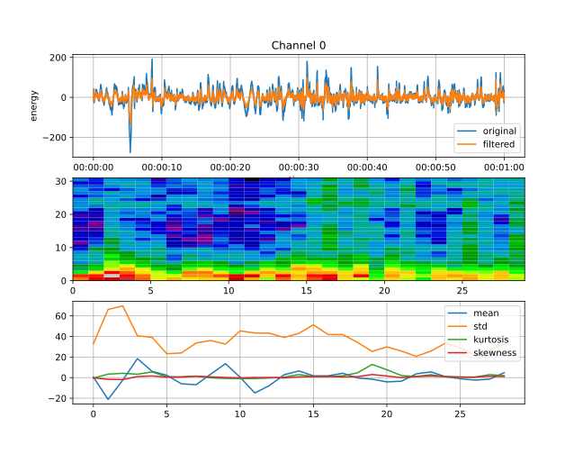

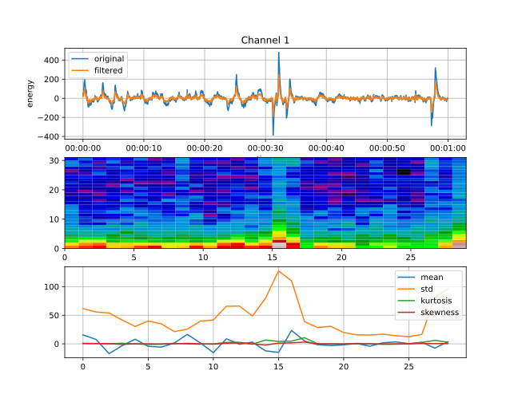

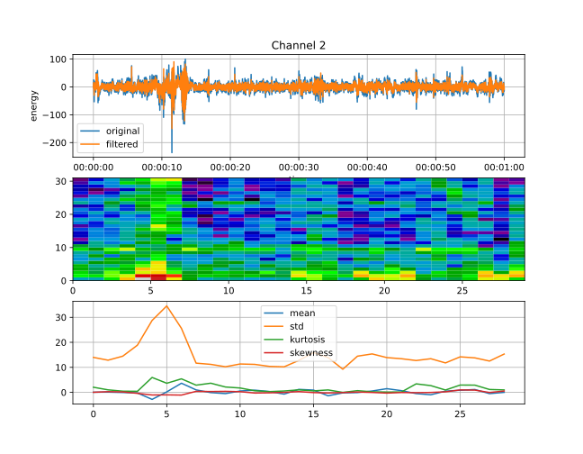

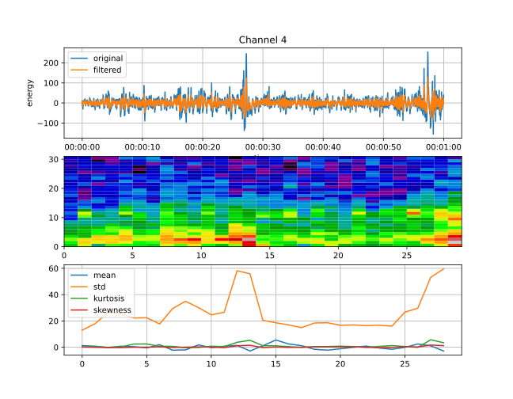

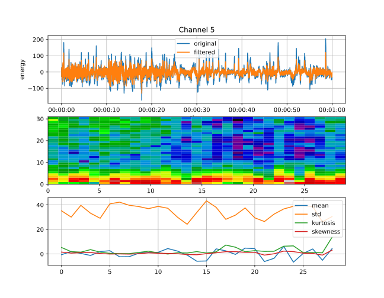

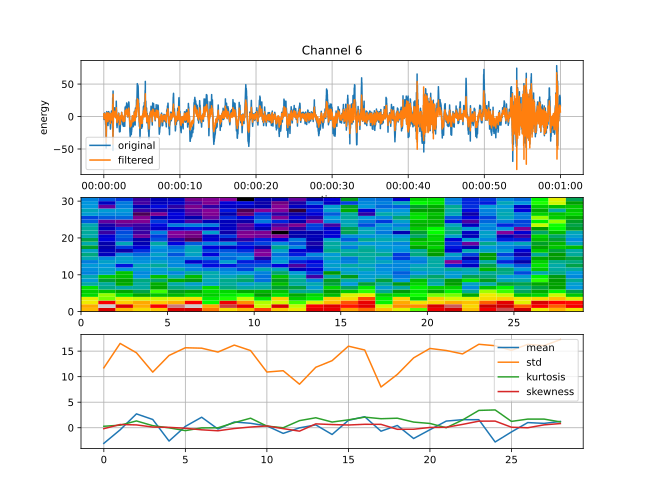

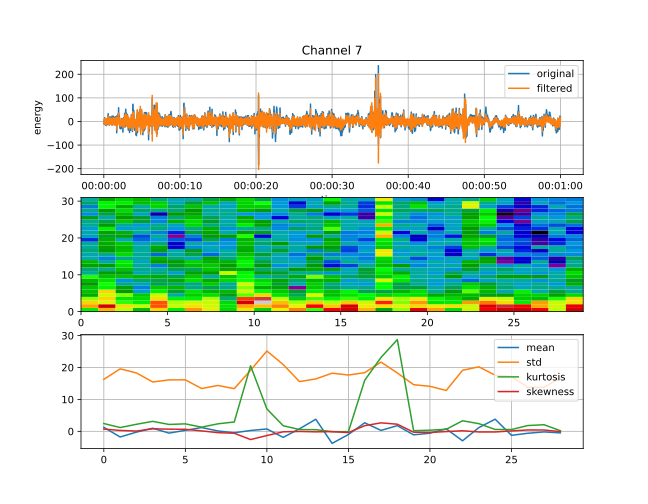

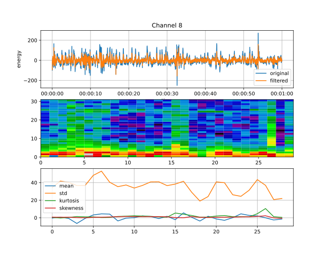

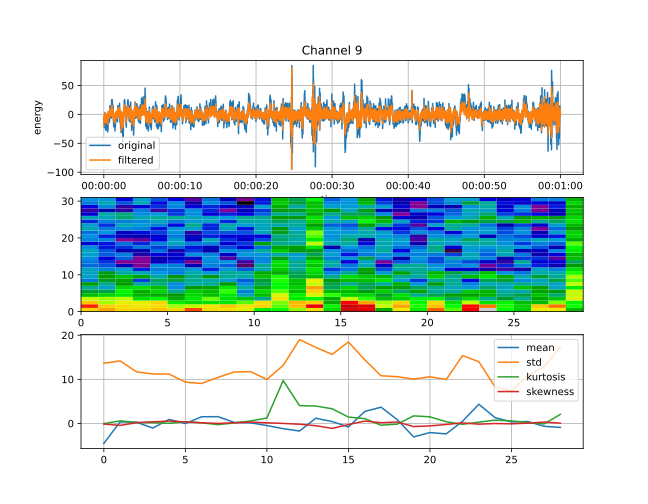

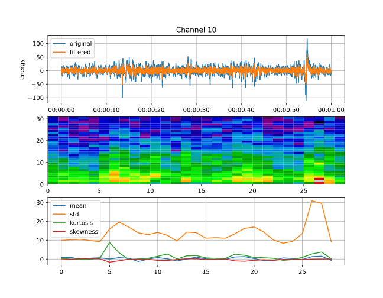

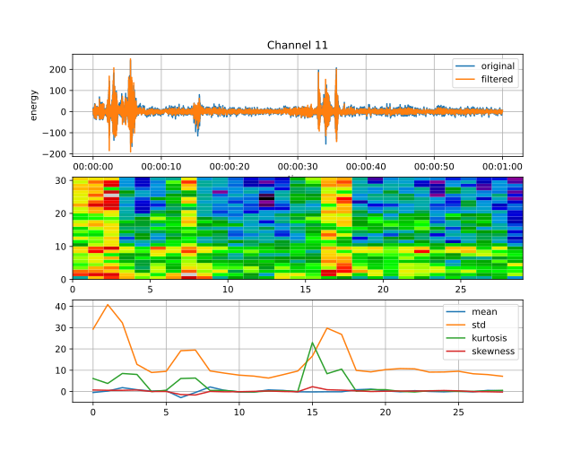

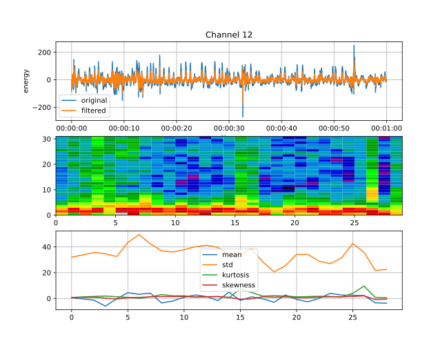

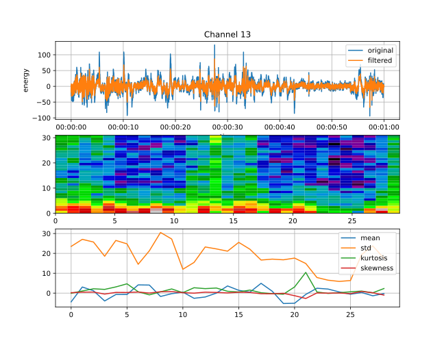

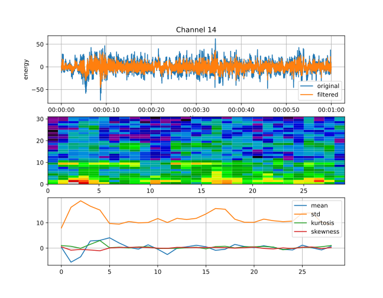

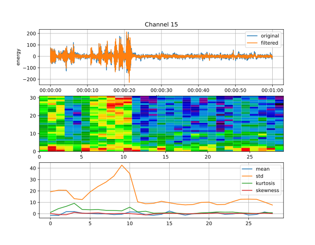

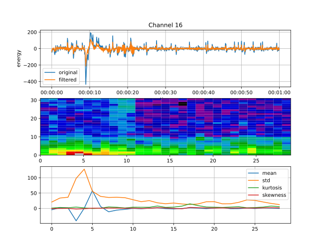

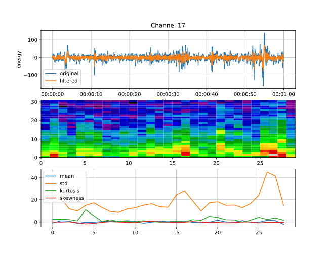

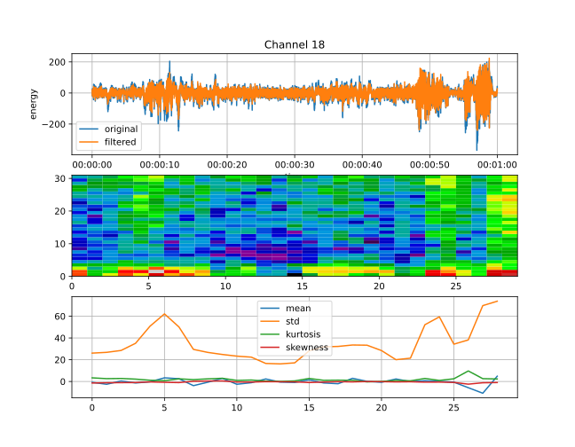

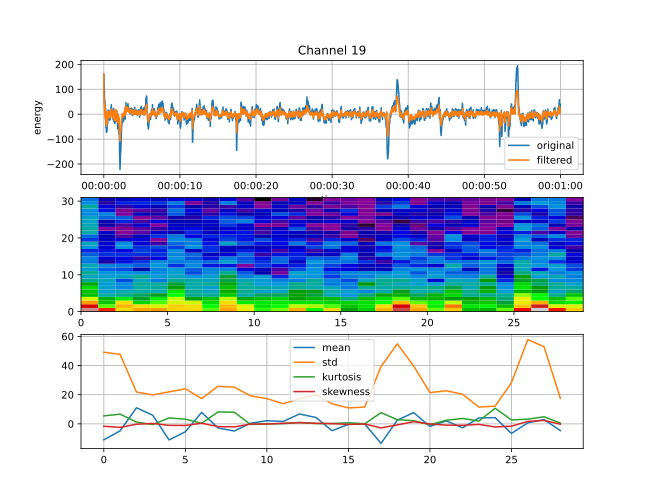

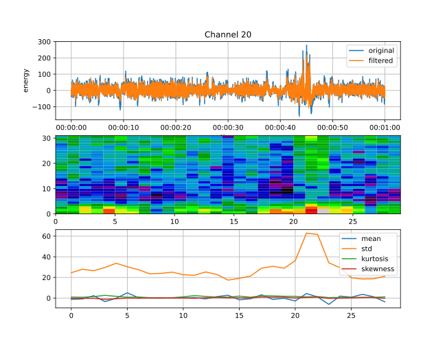

#### Other statistics extracted from the waveform

In addition to the extraction of frequential information, other statistics
have been extracted from each sliding window, in this case without the
need of applying any smoothing window.

The statistics are six in total:

- Mean

- Standard deviation

- Kurtosis

- Skewness 

- Mobility 

- Complexity

Paper [Seizure Prediction in Scalp EEG Using 3D Convolutional Neural Networks With an Image-Based Approach](docs/08848612.pdf)
explains how to compute these statistics.

******

Finally, the output of the ***short-term analysis*** is that each channel is converted to a sequence of vectors $$x_t \in \mathbb{R}^{14}$$.

- Eight components are extracted from the frequency domain, in lineally spaced pass band filters, and

- six components correspond to the above mentioned statistics.
  

## Goal of the use case and the lab practice

The available signals in the data set used here contains periods labelled by doctors
as ***ictal*** and ***inter-ictal***.
However, in order to train models for predicting ***ictal*** periods,
i.e., ***seizures***, the samples from ***inter-ictal*** periods are
automatically labelled into other classes according to human expert criteria.
Next table shows the criteria used here, with a total of 10 classes
distributed between ***pre-ictal*** and ***post-ictal*** periods.

|number of samples per class|class index|class name |
|--------------------------:|:---------:|:----------------|
|                  1130974  | 0         | inter-ictal      |
|                     5805  | 1         | ictal            |
|                   172044  | 2         | pre-ictal 1h     |
|                    98422  | 3         | pre-ictal 2h     |
|                    72885  | 4         | pre-ictal 3h     |
|                    64960  | 5         | pre-ictal 4h     |
|                    52901  | 6         | post-ictal 10m   |
|                    42856  | 7         | post-ictal 20m   |
|                    36907  | 8         | post-ictal 30m   |
|                    90818  | 9         | post-ictal 1h    |
---------------------------|-----------|-----------------
|                  1768572  |           | total           |

Recall each sample from here corresponds to a 4-second sliding window shifted
every 2 seconds, and each single channel has been processed individually, so
we have to multiply by 21 the total number of samples.

******

The **goal** is to predict seizures within the previous 60 minutes,
if it is possible, before 30 minutes of the seizure.

## Work to do in this lab practice

1. Obtain several codebooks with the algorithm **Lloyd** of K-Means using the Spark cluster
   with the Python code [kmeans_uc13.py](../../portal.dsic/examples/python/kmeans_uc13.py)

2. Compute the confusion matrix between target classes and a given number of clusters so
   that we can construct a naive classifier by using

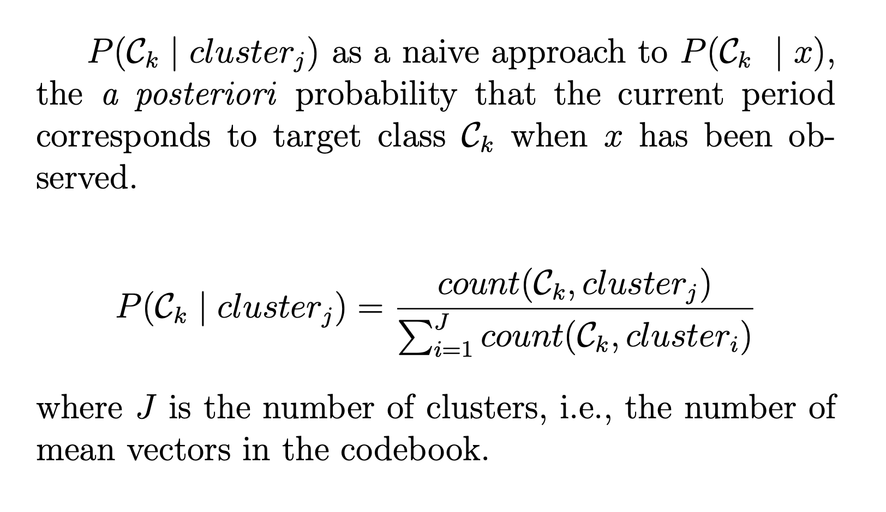

   Use the Python code [kmeans_uc13_classifier.py](../../portal.dsic/examples/python/kmeans_uc13_classifier.py)

   `K-Means models are provided, do not compute a K-Means codebook for different sizes, just test the
   algorithm and measure times`

3. Carry out several tests to evaluate the performance (KPI accuracy) of the naive classifier
   according to the number of clusters, and compare with both
   [***Calinski-Harabasz***](https://scikit-learn.org/stable/modules/clustering.html#calinski-harabasz-index)
   and
   [***Davies-Bouldin***](https://scikit-learn.org/stable/modules/clustering.html#davies-bouldin-index)
   criteria to determine the (sub-)optimal number of clusters for a given data set.

4. Obtain several **Gaussian Mixture Models (GMM)** using the Python code
   [gmm_uc13_v2.py](../../portal.dsic/examples/python/gmm_uc13_v2.py)

5. Compute a confusion matrix between target classes and the components of the GMM for different number
   of components.

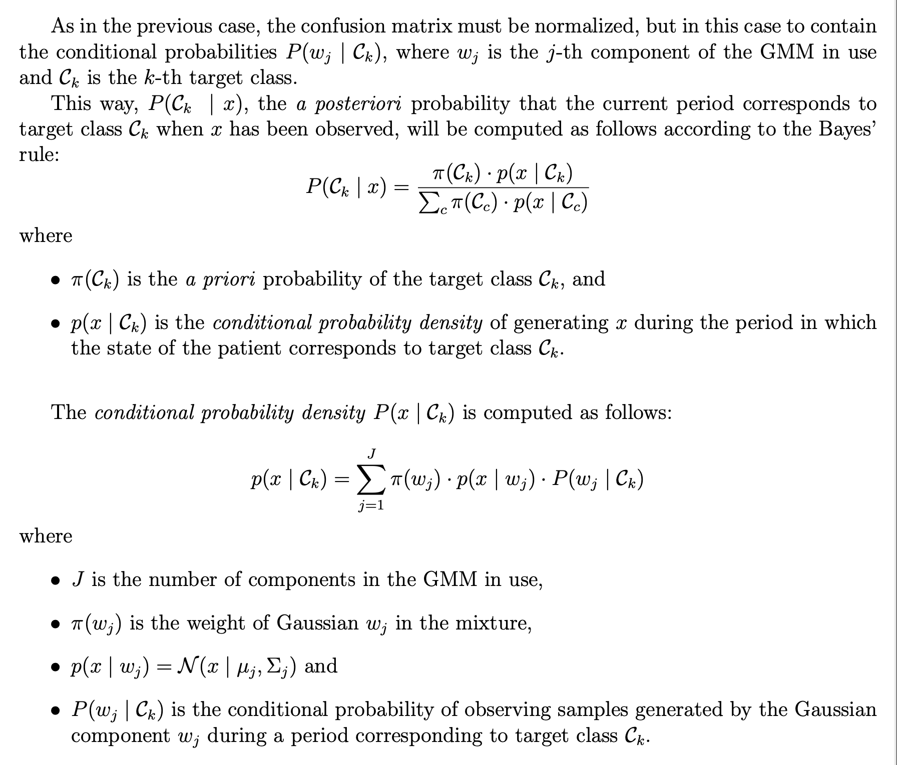

6. Carry out several tests to evaluate the performance (KPI accuracy) of the classifier 
   based on GMMs according to the $J$, the number of Gaussian components in the GMM, and
   compare with both
   the [Akaike Information Criterion (AIC)](https://en.wikipedia.org/wiki/Akaike_information_criterion)
   and 
   the [Bayesian Information Criterion (BIC)](https://en.wikipedia.org/wiki/Bayesian_information_criterion)
   criteria.

