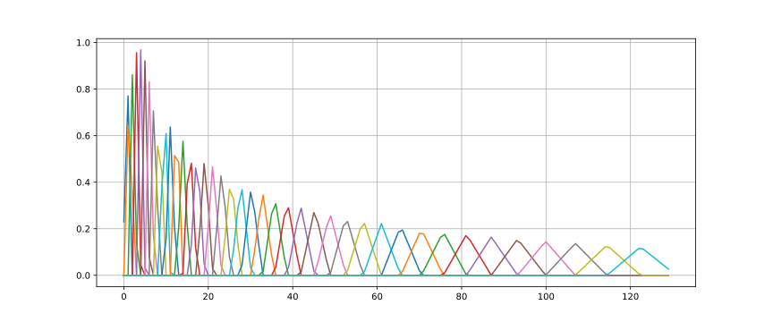
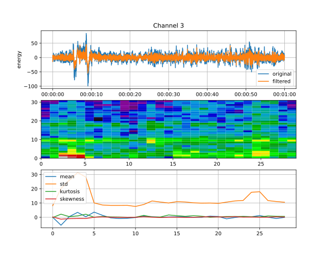

# Lab practice 1

This subsection is devoted to **lab practice 1**.

Lab practice 1 is about Use Case 13 of the [DeepHealth EU project](https://deephealth-project.eu)
based on the [CHB-MIT Scalp EEG Database](https://physionet.org/lightwave/?db=chbmit/1.0.0)

This database contains data from 24 patients, with several sessions per patient,
some sessions last 1 hour approximately, and others around 4 hours.

During each session, different channels are recorded, typically 21 or 23, each of them correspond to one or position in the scalp.
Each channel is recorded at a frequency of 256 Hz.

Next figure shows a snapshot of a 10-second recording of the channels, each channel has a different label to identify it.
More information about the meaning of the channels and how to work with them can be found in
the [same URL the database is accessible](https://physionet.org/lightwave/?db=chbmit/1.0.0)
and in some research papers, here you have two recent papers:

- [Epileptic Seizure Prediction With Multi-View Convolutional Neural Networks](docs/08910555.pdf)

- [Seizure Prediction in Scalp EEG Using 3D Convolutional Neural Networks With an Image-Based Approach](docs/08848612.pdf)


******

### Data preprocessing

The data preprocessing has been done following the typical **short-term analysis** also used for Speech recognition
and other signals.
This kind of analysis consists in assuming we are analysing a signal that contains information that do not change too fast,
that is, that for a short period of time the features we are interested in to extract from the signal do not change.
In Speech recognition, the short-term considered period is of **20-25 ms**,
in the case of EEG signals, and due to the large amount of data in the dataset used here,
the period is **4 seconds**. In both cases, and in general, a sliding window is applied. Every **10 ms** for Speech recognition
and **2 seconds** in our case.

The analysis performed for each single extracted window consists in computing the **Discrete Fourier Transform (DFT)** to obtain
a distribution of the energy contained in the signal in the frequency domain,
followed by a **filter bank** to reduce the number of channels in frequency,
that, in turn, is followed by a the **Discrete Cosine Transform** to obtain
the [Cepstral Coefficients](https://en.wikipedia.org/wiki/Mel-frequency_cepstrum) and the energy.


As the DFT is sensible to sharp changes in the signal, that usually are represented by a high amount of harmonics, 
a smoothing window is required. The most widely window used for smoothing is the
[Hamming window](https://en.wikipedia.org/wiki/Window_function#Hamming_window).
Next figure shows the shape of the Hamming window:


When the output of the DFT is available for each sliding window then a filter bank is applied.
Next figure shows the [Mel scale filter bank](https://en.wikipedia.org/wiki/Mel_scale),
the most widely used for Speech recognition.
This filter bank consists of a set of overlapping pass band filters of equal size with more resolution
on low frequencies than in high frequencies, trying to emulate the frequency discrimination carried out by our
[Cochlea](https://en.wikipedia.org/wiki/Cochlea).
For the case of EEG signals a linear instead of logarithmic filter bank is used, that is restricted to 
a specific band of frequencies.



Last step in the case of Speech recognition but no when processing EEG signals is to extract the 
[Cepstral Coefficients (CC)](https://en.wikipedia.org/wiki/Mel-frequency_cepstrum) and the energy.
In fact, the CC0 (first CC) can be considered the energy, but depending on the implementation the energy
can be computed from the raw signal in the time domain, i.e., from the waveform.

Next figure shows the first 5 filters to be applied on the output of the filter bank to obtain the
[Cepstral Coefficients (CC)](https://en.wikipedia.org/wiki/Mel-frequency_cepstrum).
Horizontal blue line constat at **1.0** is for computing the CC0, i.e., the sum of all the filters,
which is the total energy contained in the frequency domain for a given sliding window.


******

You can find more information on voice signal preprocessing in Spanish
in [this internal report from DSIC UPV](docs/param.pdf).

******

Next 21 figures contain a snapshot of 60 seconds (1 minute) of all the signals from the
session one of patient **CHB01**.





#### Other statistics extracted from the waveform

In addition to the extraction of frequential information, other statistics
have been extracted from each sliding window, in this case without the
need of applying any smoothing window.

The statistics are six in total:

- Mean

- Standard deviation

- Kurtosis

- Skewness 

- Mobility 

- Complexity

Paper [Seizure Prediction in Scalp EEG Using 3D Convolutional Neural Networks With an Image-Based Approach](docs/08848612.pdf)
explains how to compute these statistics.

******

Finally, the output of the ***short-term analysis*** is that each channel is converted into a sequence of vectors in
the 14-dimensional real space.

- Eight components are extracted from the frequency domain, in lineally spaced pass band filters, according to the
  above-mentioned paper:

  |**EEG channel**|**Frequency range**      |
  |--------------:|:------------------------|
  |delta          | 0.5Hz -- 4Hz            |
  |theta          | 4Hz -- 8Hz              |
  |alpha          | 8 -- 13                 |
  |beta           | 13 -- 30                |
  |gamma-1        | 30 -- 50                |
  |gamma-2        | 50 -- 56 + 64 -- 75     |
  |gamma-3        | 75 -- 100               |
  |gamma-4        | 100 -- 116 + 124 -- 128 |

  
- and six components corresponding to the above mentioned statistics.
  In our current implementation we are using **energy** instead of the **mean**.
  

## Goal of the use case and the lab practice

The available signals in the data set used here contains periods labelled by doctors
as ***ictal*** and ***inter-ictal***.
However, in order to train models for predicting ***ictal*** periods,
i.e., ***seizures***, the samples from ***inter-ictal*** periods are
automatically labelled into other classes according to human expert criteria.
Next table shows an example of criteria with a total of 10 classes
distributed between ***pre-ictal*** and ***post-ictal*** periods.
Choosing the criteria to separate periods is relevant to obtain good results
for early detection.

|number of samples per class|class index|class name |
|--------------------------:|:---------:|:----------------|
|                  1130974  | 0         | inter-ictal      |
|                     5805  | 1         | ictal            |
|                   172044  | 2         | pre-ictal 1h     |
|                    98422  | 3         | pre-ictal 2h     |
|                    72885  | 4         | pre-ictal 3h     |
|                    64960  | 5         | pre-ictal 4h     |
|                    52901  | 6         | post-ictal 10m   |
|                    42856  | 7         | post-ictal 20m   |
|                    36907  | 8         | post-ictal 30m   |
|                    90818  | 9         | post-ictal 1h    |
|                  1768572  |           | total           |


Recall each sample from here corresponds to a 4-second sliding window shifted
every 2 seconds, and each single channel has been processed individually, so
we have to multiply by 21 the total number of samples.

******

The **goal** is to predict seizures within the previous 60 minutes,
if it is possible, before 30 minutes of the seizure.


## Work to do in this lab practice (not in one single lab session)

1. KMeans on MNIST Digits database:

   Obtain several codebooks with the **Lloyd**'s algorithm of K-Means using the Spark cluster
   with the Python code [kmeans_mnist.py](../../portal.dsic/examples/python/kmeans_mnist.py)

   _In fact, you do not have to run it because the results are also available and there
   is no time to execute all the runs by all the students. Anyway, the command to execute
   it, assuming you are in your home directory, is:_

   ```bash
    
       teaa/examples/scripts/run-python.sh teaa/examples/python/kmeans_mnist.py
    
   ```

   Results for several clustering sizes ranging from 10 to 1000 can be found in
   [results.digits.train](../../portal.dsic/examples/results/digits/kmeans/train)
   and 
   [results.digits.test](../../portal.dsic/examples/results/digits/kmeans/test)

   Of interest the matrices with the conditional probabilities of observing samples
   corresponding to one cluster with respect to each digit. For instance:
   [conditional-probabilities-kmeans-10-0010.png](../../portal.dsic/examples/results/digits/kmeans/train/conditional-probabilities-kmeans-10-0010.png)

   You can see the evolution of the criteria 
   [Calinski-Harabasz](https://scikit-learn.org/stable/modules/clustering.html#calinski-harabasz-index)
   and
   [Davies-Bouldin](https://scikit-learn.org/stable/modules/clustering.html#davies-bouldin-index)
   to determine the (sub-)optimal number of clusters for a given data set in the file:
   [kmeans-kpis.txt](../../portal.dsic/examples/logs/digits/kmeans/kmeans-kpis.txt)


   Are you able to obtain some preliminary conclusions about the similarities between some digits which are reflected,
   somehow, in the conditional probabilities?

   You can obtain the evolution of the accuracy versus the size of the clustering by executing the script:

   ```bash
       cd ~/teaa/examples

       scripts/mnist-see-accuracy-evolution-kmeans.sh 
   ```

   The result is a CSV file whose absolute path in the filesystem of the master
   is **/tmp/mnist-kmeans-accuracy-evolution.csv**,
   but you can find it [here](../../portal.dsic/examples/results/digits/kmeans/test/mnist-kmeans-accuracy-evolution.csv)


2. KMeans on UC13 dataset (applied to each patient individually):

   Obtain several codebooks with the **Lloyd**'s algorithm of K-Means using the Spark cluster
   with the Python code [kmeans_uc13_21x20.py](../../portal.dsic/examples/python/kmeans_uc13_21x20.py)

   _In fact, you do not have to run it because the results are also available and there
   is no time to execute all the runs by all the students. Anyway, some examples of the
   command to execute it, assuming you are in your home directory, are:_

   ```bash
       teaa/examples/scripts/run-python.sh teaa/examples/python/kmeans_uc13_21x20.py --patient chb01 --do-binary-classification --train --classify
    
       teaa/examples/scripts/run-python.sh teaa/examples/python/kmeans_uc13_21x20.py --patient chb24 --train --classify
   ```

   Results for several clustering sizes ranging from 10 to 150 per patient can be found in
   [uc13-21x20](../../portal.dsic/examples/uc13-21x20), where you will find one directory per patient,
   and inside each patient one directory per run. Let us see the directories corresponding to patient __chb01__:

   Binary classification:

   - [results.02-classes.train](../../portal.dsic/examples/uc13-21x20/chb01/results.02-classes.train)

   - [results.02-classes.test](../../portal.dsic/examples/uc13-21x20/chb01/results.02-classes.test)

   Multiclass classification:

   - [results.10-classes.train](../../portal.dsic/examples/uc13-21x20/chb01/results.10-classes.train)

   - [results.10-classes.test](../../portal.dsic/examples/uc13-21x20/chb01/results.10-classes.test)

   _In these directories, you will also find the results using GMMs which will be commented later, now you can ignore them._

   You can see the evolution of the criteria 
   [Calinski-Harabasz](https://scikit-learn.org/stable/modules/clustering.html#calinski-harabasz-index)
   and
   [Davies-Bouldin](https://scikit-learn.org/stable/modules/clustering.html#davies-bouldin-index)
   to determine the (sub-)optimal number of clusters for a given data set in the file
   [kmeans-kpis-chb01.txt](../../portal.dsic/examples/uc13-21x20/chb01/log/kmeans-kpis-chb01.txt)
   for patient **chb01**. The files for the others patients are in the corresponding directory, you only
   have to change the patient identifier in the path.


   Additionally, in 
   [the directory of the models corresponding to patient **chb01**](../../portal.dsic/examples/uc13-21x20/chb01/models/)
   you can find CSV files with the cluster distribution with respect to each target class, for instance
   [cluster-disribution-0010.csv](../../portal.dsic/examples/uc13-21x20/chb01/models/cluster-distribution-0010.csv),
   from which you can generate the matrix of conditional probabilities by modifying the Python code 
   [see_conditional_probabilities.py](../../portal.dsic/examples/python/see_conditional_probabilities.py)


3. Gaussian Mixture Models on MNIST Digits database (one GMM per target class):

   A grid search varying different configuration parameters have been done using the Python code
   [gmm_mnist_2022.py](../../portal.dsic/examples/python/gmm_mnist_2022.py)

   The results can be found in [results.l1.digits.2022.test/](../../portal.dsic/examples/results.l1.digits.2022.test/),
   where the name of the files with the results contain the values of the configuration parameters.

   - The value for the number of componente of the GMM of each target class varies from 3 to 70, you will see
     that small values of this configuration parameter are enough to obtain good results.

   - The number of PCA components to reduce the dimensionality of the input space to more manegeable dimensions.
     Again, you will see that once reached a sufficient value no improvements are observed by increasing it.

   - Both **full** and **diagonal** convariance matrix types are used.
     For the **full** covariance matrices it is important to change the minimum value allowed for variances.

   - Minimum value for the variances. Using **diagonal** covariance matrices this value can be 1.0e-5 or smaller,
     but if the training fails due to the lack of precision on arithmetic operations, then use a higher value.
     In the case of **full** covariance matrices, this problem arises earier, so a value of 1.0 is enough for
     many configurations, you can try smaller values, 0.5 for instance.

   Students have to run the code with different configurations in order to see how this task is solved.
   An example is:

   ```bash
   
       teaa/examples/scripts/run-python.sh teaa/examples/python/gmm_mnist_2022.py 13 --pca 31 --convergenceTol 1.0e-3 --covarType full --minVar 1.0
   
   ```

   The script used to execute the grid search can be found in [run-mnist-gmm-grid.sh](../../portal.dsic/examples/scripts/run-mnist-gmm-grid.sh)

   Similar to the case when using K-Means, the evolution of the accuracy using GMMs depending on different
   hyper-parameters is available [here](../../portal.dsic/examples/results.l1.digits.2022.test/mnist-gmm-accuracy-evolution.csv).
   You can do several representations of these data; for instance, the evolution of the accuracy versus the
   number of componentes in the GMM for different number of components of PCA.


4. Gaussian Mixture Models on UC13 dataset (applied to each patient individually, one GMM per target class):

   No grid search has been carried out for this dataset, not feasible in time with the available resources in the cluster.

   The code used to generate the results is [gmm_uc13_21x20.py](../../portal.dsic/examples/python/gmm_uc13_21x20.py)

   The script to execute all the runs for all the patients using both binary and multi-class classifications is the following:

   ```bash
      for patient in {01..24}
      do
          scripts/run-python.sh python/gmm_uc13_21x20.py --patient chb${patient} --do-binary-classification
          scripts/run-python.sh python/gmm_uc13_21x20.py --patient chb${patient}
      done
   ```

   The results can be found in the directory
   [uc13-21x20](../../portal.dsic/examples/uc13-21x20), where you will find one directory per patient,
   and inside each patient one directory per run.
   Let us see the directories corresponding to patient __chb01__:

   Binary classification:

   - [results.02-classes.train](../../portal.dsic/examples/uc13-21x20/chb01/results.02-classes.train)

   - [results.02-classes.test](../../portal.dsic/examples/uc13-21x20/chb01/results.02-classes.test)

   Multiclass classification:

   - [results.10-classes.train](../../portal.dsic/examples/uc13-21x20/chb01/results.10-classes.train)

   - [results.10-classes.test](../../portal.dsic/examples/uc13-21x20/chb01/results.10-classes.test)

   _These directories are the same where the results of the classifiers based on KMeans are stored,
   in this case you have to inspect the files whose name starts by **gmm** and ignore the ones starting with **kmeans**._

   It has not been possible to carry out different runs varying the maximum number of components of each GMM 
   used for modelling the region in the *d*-dimensonal space where the samples of each target class are distributed.
   In our case, the maximum number of components of each GMM has been set to 30
   and only the **diagonal** convariance matrix of each Gaussian component has been used.
   However, as the strategy to estimate each GMM is automatic splitting starting from one single GMM component,
   it could be possible that for some GMMs the number of components will lower than 30.


5. It would have been interesting to carry out several runs to evaluate the performance (KPI accuracy)
   of the classifiers based on GMMs according to **J**, the number of Gaussian components in the GMM, and
   compare it with both
   the [Akaike Information Criterion (AIC)](https://en.wikipedia.org/wiki/Akaike_information_criterion)
   and 
   the [Bayesian Information Criterion (BIC)](https://en.wikipedia.org/wiki/Bayesian_information_criterion)
   criteria.
   But a larger set of runs is required.
