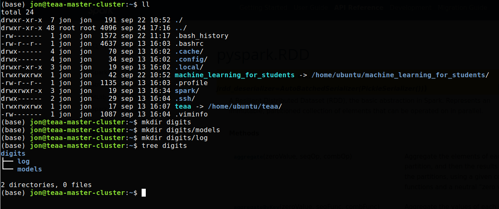
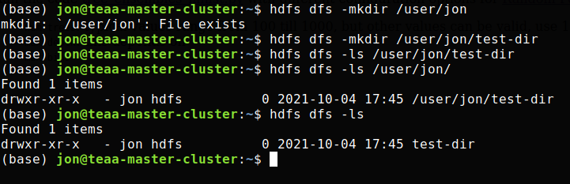
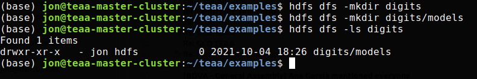
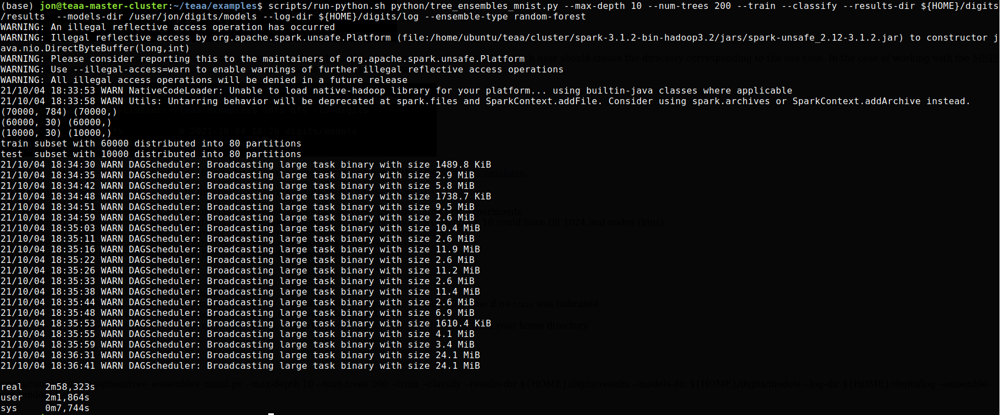
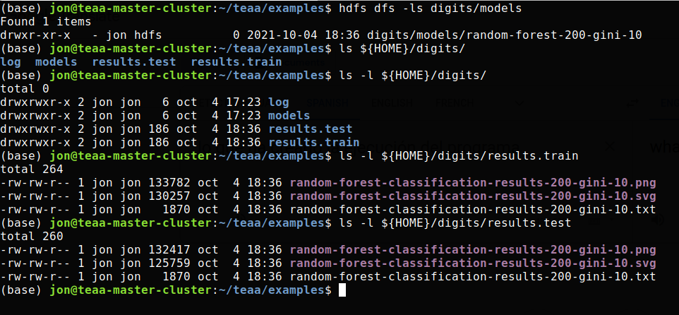
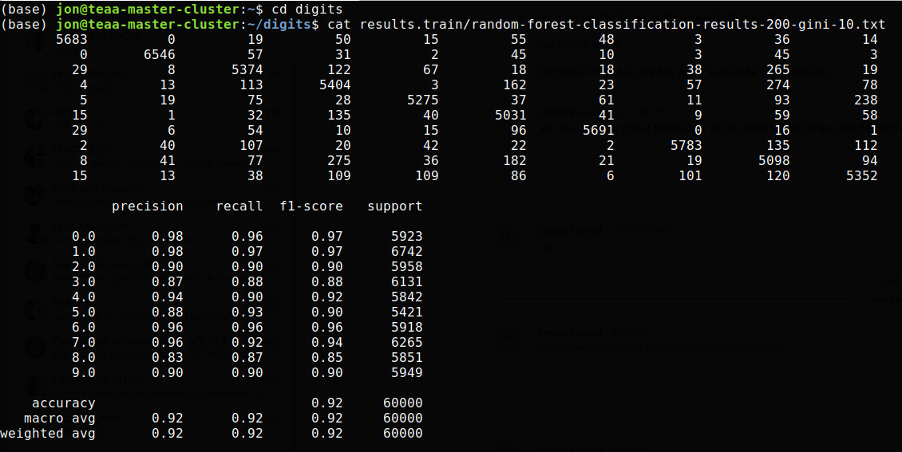
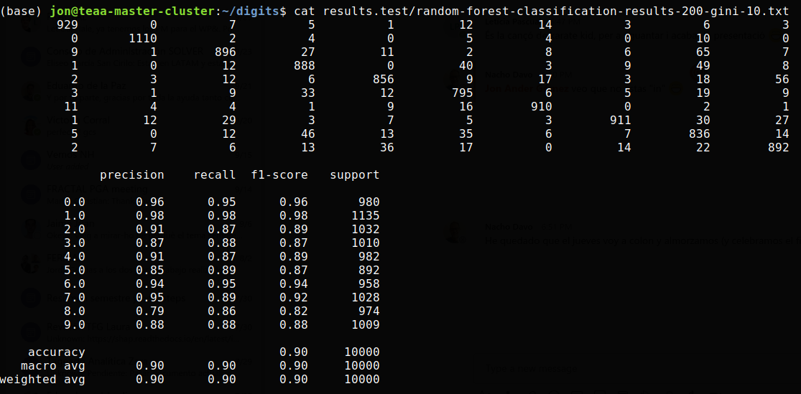

# Lab practice 2

Lab practice 2 is about two use cases:

1. [MNIST Digits database](https://en.wikipedia.org/wiki/MNIST_database)

2. Use Case 13 of the [DeepHealth EU project](https://deephealth-project.eu)
   based on the [CHB-MIT Scalp EEG Database](https://physionet.org/lightwave/?db=chbmit/1.0.0),
   and already presented in [Lab practice 1](../pract_1)

## Work to do in this lab practice

1. Accessing to the cluster from a computer in the UPVNET domain or via Virtual Private Network (VPN) previously configured

    >    `ssh -YC jon@teaa-master-cluster.dsic.upv.es`

2. Interaction with the Hadoop Distributed File System (HDFS)

   Once in the system, the first step is to see what we can find in the HDFS.
   The datasets to be used are in the directory of the `ubuntu` user, so we have
   to use the absolute path to see what it contains: `/user/ubuntu`.

   

3. Creation of local dirs in user home directory

   Before running some examples, as the output of the programs will be stored in the
   local filesystem, we need to create some local dirs in advance.

   

4. Creation of the user directory in the HDFS

   And as it will be necessary later, we have to create some directories in the HDFS.
   In particular our own directory if it does not exist yet, and some another
   directory as an example for discovering how directories are created.

   

   In particular, when using the Spark implentation of some training algorithms, the
   models are stored in the HDFS, each user should create the directory corresponding
   to the use case. In the case of working with the 
   [MNIST Digits database](https://en.wikipedia.org/wiki/MNIST_database)
   we have to create `/user/jon/digits/models`, please, replace `jon` with your username.

   

5. Inspect the code [tree_ensembles_mnist.py](../../portal.dsic/examples/python/tree_ensembles_mnist.py)
   to be used in this lab session for working with the
   [MNIST Digits database](https://en.wikipedia.org/wiki/MNIST_database),

6. Run the code [tree_ensembles_mnist.py](../../portal.dsic/examples/python/tree_ensembles_mnist.py)
   with different configuration options for [Random Forest](https://en.wikipedia.org/wiki/Random_forest):
    

    - `num-trees`: typical values range from 100 till 1000, but other values can be valid, use 100 in the first experiments
    - `max-depth`: this depends on the dataset and the task, but take into account that a binary tree with depth 10 could have till 1024 leaf nodes (bins)
    - `max-bins`: another limit to the size of the tree is the total number of allowed bins, i.e., leaf nodes
    - `ensemble-type`: by default is `random-forest`, other values are `extra-trees` and `gradient-boosted-trees`
    - `impurity` : depends on the ensemble type, basically, allowed values are `gini` and `entropy`

    Other command line options:

    - `train`: to indicate the training procedure must be run
    - `classify`: to indicate that the inference procedure must be run, this requires to provide a model filename if no `train` was indicated
    - `model <filename>`: to provide the name of the file containing the previously trained model
    - `results-dir <dirname>`: to indicate where to store the results, **important**: this must refer to a directory from your home directory

    Example of how to run the program:

    >
    >    `cd teaa/examples`
    >
    >    `scripts/run-python.sh python/tree_ensembles_mnist.py --max-depth 10 --num-trees 200 --train --classify --results-dir ${HOME}/digits/results --models-dir /user/jon/digits/models --log-dir ${HOME}/digits/log --ensemble-type random-forest`
    >

    Let see an example of executing this instruction:

    

7. What the program execution has created

   The models have been stored in the HDFS, and the results in the local disk.
   Next figure shows how to see where the models and the results are stored.

   

8. The results can be seen from the text file complementary to the figures

   Here the results with the training subset:

   

   Here the results with the testing subset:

   

   You can see the images with `viewnior`:

    >
    > `cd`
    > 
    > `cd digits`
    >
    > `viewnior results.train/random-forest-classification-results-200-gini-10.png`
    >
    > `viewnior results.train/random-forest-classification-results-200-gini-10.svg`
    >

9. Do similar steps for the use case based on the
   [CHB-MIT Scalp EEG Database](https://physionet.org/lightwave/?db=chbmit/1.0.0)

   In this case the code available is
   [tree_ensembles_uc13.py](../../portal.dsic/examples/python/tree_ensembles_uc13.py)

    >
    >    `cd`
    >
    >    `mkdir -p uc13/results.train`
    >
    >    `mkdir -p uc13/results.test`
    >
    >    `hdfs dfs -mkdir -p uc13/models`
    >
    >    `cd teaa/examples`
    >
    >    `scripts/run-python.sh python/tree_ensembles_uc13.py --max-depth 5 --num-trees 100 --train --classify --results-dir ${HOME}/uc13/results.train --models-dir /user/jon/uc13/models --log-dir ${HOME}/uc13/log --ensemble-type random-forest  --dataset /user/ubuntu/data/uc13-pca-train.csv`
    >
    >    `scripts/run-python.sh python/tree_ensembles_uc13.py --max-depth 5 --num-trees 100 --classify --results-dir ${HOME}/uc13/results.test --model uc13/models/random-forest-100-gini-5 --ensemble-type random-forest  --dataset /user/ubuntu/data/uc13-pca-test.csv`
    >

10. See where the models and the results have been stored:

    >
    > `hdfs dfs -ls uc13/models`
    >
    > `cd`
    >
    > `cd uc13`
    >
    > `cat results.train/random-forest-classification-results-100-gini-5.txt`
    >
    > `cat results.test/random-forest-classification-results-100-gini-5.txt`
    >
    > `viewnior results.train/random-forest-classification-results-100-gini-5.png`
    >
    > `viewnior results.test/random-forest-classification-results-100-gini-5.png`
    >

11. Do the same using `extra-trees` instead of `random-forest`

    In this case the `models-dir` option should refer to a directory in the local filesystem instead of the HDFS
    because the _Extra-Trees_ do not work in Apache Spark, the only work in local.
    But do not worry, _Extra-Trees_  are fast.
