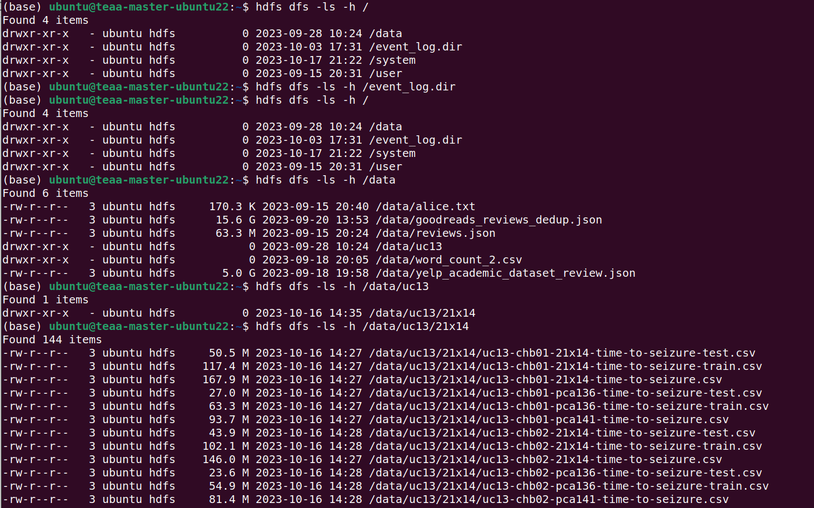

# Lab practice 2

Lab practice 2 is about two use cases:

1. [MNIST Digits database](https://en.wikipedia.org/wiki/MNIST_database)

2. Use Case 13 of the [DeepHealth EU project](https://deephealth-project.eu)
   based on the [CHB-MIT Scalp EEG Database](https://physionet.org/lightwave/?db=chbmit/1.0.0),
   and already presented in [Lab practice 1](../pract_1)


## Work to do in this lab practice

1. **Accessing to the cluster from a computer in the UPVNET domain or via Virtual Private Network (VPN) previously configured**

   ```bash
   ssh -YC username@teaa-master-ubuntu22.dsicv.upv.es
   ```

   please, replace `username` with yours.


1. **Interaction with the Hadoop Distributed File System (HDFS)**

   Once in the system, the first step is to see what we can find in the HDFS.
   The datasets to be used are in the directory of the `/data` user, so we have
   to use the absolute path to see what it contains: `/data/uc13/21x14` for instance.

   

   It is relevant to see the directory were data is stored:

   ```bash
   hdfs dfs -ls -h /data/
   ```

   and

   ```bash
   hdfs dfs -ls -h /data/uc13/21x14
   ```

1. **Creation of local dirs in user home directory**

   The directories are created from the Python code automatically, but if required,
   here some examples of how to create local directories in your home directory.

   ```bash
   cd ${HOME}

   mkdir -p results/digits/ensembles/ert
   mkdir -p results/digits/ensembles/rf
   mkdir -p results/digits/ensembles/gbt
   ```

   And how to see the contents of the tree structure.

   ```bash
   cd ${HOME}

   tree results/digits/ensembles
   ```

1. **Inspect the code** [rf_mnist.py](../../portal.dsic/examples/python/rf_mnist.py)
   **to be used in this lab session for working with the**
   [MNIST Digits database](https://en.wikipedia.org/wiki/MNIST_database)

1. **Run the code** [rf_mnist.py](../../portal.dsic/examples/python/rf_mnist.py)
   **with different configuration options for** [Random Forest](https://en.wikipedia.org/wiki/Random_forest):
    

    - `numTrees`: typical values range from 100 till 1000, but other values can be valid, use 100 in the first experiments
    - `maxDepth`: this depends on the dataset and the task, but take into account that a binary tree with depth 10 could have till 1024 leaf nodes (bins)
    - `pcaComponents`: this depends on the dataset and the task, but take into account that a binary tree with depth 10 could have till 1024 leaf nodes (bins)
    - `impurity` : depends on the ensemble type, basically, allowed values are `gini` and `entropy` **not changed, using the default one**

    Other command line options:

    - `baseDir`: base directory from which create others
    - `resultsDir`: directory relative to `baseDir` where to store results
    - `modelsDir`: directory relative to `baseDir` where to store models, **not used in this case**
    - `logDir`: directory relative to `baseDir` where to store logs of the execution, **not used in this case**

    Example of how to run the program:

   ```bash
   cd ${HOME}

   teaa/examples/scripts/run-python.sh teaa/examples/python/rf_mnist.py \
            --numTrees 10 --maxDepth 7 --pcaComponents 40
   ```

1. **What the program execution has created**

   The models have not been stored in this example, and the results are stored in the local disk.
   Next instructions show you how to see the files created.

   ```bash
   cd ${HOME}

   ls -l results/digits/ensembles/rf/train

   ls -l results/digits/ensembles/rf/test
   ```

1. **The results can be seen from the text file complementary to the figures**

   ```bash
   cd ${HOME}

   cat results/digits/ensembles/rf/train/rf_00010_pca_0040_maxdepth_007.txt

   cat results/digits/ensembles/rf/test/rf_00010_pca_0040_maxdepth_007.txt
   ```

   The images can be downloaded to your computer and then visualized, anyway all the results are available
   in the repository exploring the following directories:

   - [results/digits/ensembles/rf/train](../../portal.dsic/examples/results/digits/ensembles/rf/train)
   - [results/digits/ensembles/rf/test](../../portal.dsic/examples/results/digits/ensembles/rf/test)

   And the script for running all the experiments by varying the different hyper-parameters can be found here
   [scripts/run-mnist-rf-grid.sh](../../portal.dsic/examples/scripts/run-mnist-rf-grid.sh)


   We can see a summary of the results with the following commands:

   ```bash
   cd ${HOME}/teaa/examples

   grep " macro avg " results/digits/ensembles/rf/test/*.txt
   grep " macro avg " results/digits/ensembles/rf/train/*.txt

   grep " macro avg " results/digits/ensembles/rf/train/*.txt | sort -nk 6
   grep " macro avg " results/digits/ensembles/rf/test/*.txt | sort -nk 6
   ```

   And you can extract the results for all the combinations of hyper-parameters to represent them in a command like the following one:

   ```bash
   cd ${HOME}/teaa/examples

   grep " macro avg " results/digits/ensembles/rf/test/*.txt | sed -e 's/_/ /g' -e 's/\.txt/ /g' | awk '{ print $2, $4, $6, $10, $11, $12 }'
   ```

   in order to graphically represent them using the appropriate software tool (of your preference).


1. **Do the same using `extra-trees` instead of `random-forest` for**
   [MNIST Digits database](https://en.wikipedia.org/wiki/MNIST_database).
   **Inspect and run the code** [ert_mnist.py](../../portal.dsic/examples/python/ert_mnist.py)

    The command line options are the same used for Random Forest. See it above.
    In this case the `impurity` is used.

    ```bash
    cd ${HOME}

    teaa/examples/scripts/run-python.sh teaa/examples/python/ert_mnist.py \
            --numTrees 10 --maxDepth 7 --pcaComponents 40
    ```

    The results can be found with the following commands:

    ```bash
    cd ${HOME}

    ls -l results/digits/ensembles/ert/train

    ls -l results/digits/ensembles/ert/test
    ```

    And visualizing the text results with the following commands:

    ```bash
    cd ${HOME}

    cat results/digits/ensembles/ert/train/ert_00010_pca_0040_maxdepth_007.txt

    cat results/digits/ensembles/ert/test/ert_00010_pca_0040_maxdepth_007.txt
    ```

   The images can be downloaded to your computer and then visualized, anyway all the results are available
   in the repository exploring the following directories:

   - [results/digits/ensembles/ert/train](../../portal.dsic/examples/results/digits/ensembles/ert/train)
   - [results/digits/ensembles/ert/test](../../portal.dsic/examples/results/digits/ensembles/ert/test)

   And the script for running all the experiments by varying the different hyper-parameters can be found here
   [scripts/run-mnist-ert-grid.sh](../../portal.dsic/examples/scripts/run-mnist-ert-grid.sh)


1. **Do similar steps for the use case based on the**
   [CHB-MIT Scalp EEG Database](https://physionet.org/lightwave/?db=chbmit/1.0.0)

   **Inspect and run the code** [rf_uc13.py](../../portal.dsic/examples/python/rf_uc13.py)

   ***THIS ACADEMIC YEAR THE RESULTS FOR EEG DATA HAVE BEEN COMPUTED IN ANOTHER COMPUTER***

   ***DO NOT RUN THE EXAMPLE***

   ***INSTEAD SEE THE CODE*** [ml_on_uc13_21x14.py](../../portal.dsic/examples/python/ml_on_uc13_21x14.py)

   ```bash
   cd ${HOME}

   teaa/examples/scripts/run-python.sh teaa/examples/python/rf_uc13.py chb03 \
            --numTrees 50 --doBinaryClassification --usingPCA 
   ```


1. **See where the results have been stored (if it were possible to run the code, now the pre-computed ones):**

   ```bash
   cd ${HOME}/teaa/examples

   cat results/uc13/ensembles/chb03/rf/train/rf-chb03-pca136-binary-classification-1000-011.txt
   cat results/uc13/ensembles/chb03/rf/train/rf-chb03-pca136-multi-class-classification-1000-011.txt

   cat results/uc13/ensembles/chb03/rf/test/rf-chb03-pca136-binary-classification-1000-011.txt
   cat results/uc13/ensembles/chb03/rf/test/rf-chb03-pca136-multi-class-classification-1000-011.txt
   ```

   **NOTICE** you have available results for binary classification and for multi-class classification.

   The images can be downloaded to your computer and then visualized, anyway all the results are available
   in the repository exploring the following directories:

   - [results/uc13/ensembles/chb03/rf/train](../../portal.dsic/examples/results/uc13/ensembles/chb03/rf/train/)
   - [results/uc13/ensembles/chb03/rf/test](../../portal.dsic/examples/results/uc13/ensembles/chb03/rf/test/)

   As in previous steps, in order to extract results with all the combinations of hyper-parameters, you can use a command like the next one:

    ```bash   
        cd ${HOME}/teaa/examples

        grep " macro avg " results/uc13/ensembles/chb*/rf/test/*.txt \
            | sed -e 's/multi-class/multiclass/g' -e 's/-/ /g' -e 's/\.txt/ /g' \
            | awk '{ print $2, $3, $4, $6, $7, $11, $12, $13 }'
    ```


1. **Do the same using `extra-trees` instead of `random-forest` for**
   [CHB-MIT Scalp EEG Database](https://physionet.org/lightwave/?db=chbmit/1.0.0)

   **Inspect and run the code** [ert_uc13.py](../../portal.dsic/examples/python/ert_uc13.py)

   ***THIS ACADEMIC YEAR THE RESULTS FOR EEG DATA HAVE BEEN COMPUTED IN ANOTHER COMPUTER***

   ***DO NOT RUN THE EXAMPLE***

   ***INSTEAD SEE THE CODE*** [ml_on_uc13_21x14.py](../../portal.dsic/examples/python/ml_on_uc13_21x14.py)


    ```bash
    cd ${HOME}

    teaa/examples/scripts/run-python.sh teaa/examples/python/ert_uc13.py chb03 \
            --numTrees 50 --maxDepth 7 --doBinaryClassification --usingPCA 
    ```

    The results can be found and visualized with the following commands:

    ```bash
    cd ${HOME}/teaa/examples

    cat results/uc13/ensembles/chb03/ert/train/ert-chb03-pca136-binary-classification-1000-011.txt
    cat results/uc13/ensembles/chb03/ert/train/ert-chb03-pca136-multi-class-classification-1000-011.txt

    cat results/uc13/ensembles/chb03/ert/test/ert-chb03-pca136-binary-classification-1000-011.txt
    cat results/uc13/ensembles/chb03/ert/test/ert-chb03-pca136-multi-class-classification-1000-011.txt
    ```

   **NOTICE** you have available results for binary classification and for multi-class classification.

    The images can be downloaded to your computer and then visualized, anyway all the results are available
    in the repository exploring the following directories:

    - [results/uc13/ensembles/chb03/ert/train](../../portal.dsic/examples/results/uc13/ensembles/chb03/ert/train/)
    - [results/uc13/ensembles/chb03/ert/test](../../portal.dsic/examples/results/uc13/ensembles/chb03/ert/test/)

    ```bash   
        cd ${HOME}/teaa/examples

        grep " macro avg " results/uc13/ensembles/chb*/ert/test/*.txt \
            | sed -e 's/multi-class/multiclass/g' -e 's/-/ /g' -e 's/\.txt/ /g' \
            | awk '{ print $2, $3, $4, $6, $7, $11, $12, $13 }'
    ```


1. **Do the same using `gradient-boosted-trees` instead of `random-forest` or `extra-trees` for**
    [MNIST Digits database](https://en.wikipedia.org/wiki/MNIST_database).

	1. Using regressors then categorizing the predicted values.
	    Inspect and run the code [gbt_mnist.py](../../portal.dsic/examples/python/gbt_mnist.py)

		The command line options are the same used for Random Forest and Extremely Randomized Trees. See it above.
		In this case the `impurity` is used but fixed to `variance`.

        ```bash
        cd ${HOME}

        teaa/examples/scripts/run-python.sh teaa/examples/python/gbt_mnist.py \
                --numTrees 10 --maxDepth 7 --pcaComponents 40
        ```

        The results can be found with the following commands:

		```bash
		cd ${HOME}

		ls -l results/digits/ensembles/gbt.r/train

		ls -l results/digits/ensembles/gbt.r/test
		```

        And visualizing the text results with the following commands:

        ```bash
        cd ${HOME}

        cat results/digits/ensembles/gbt.r/train/gbt_00010_pca_0040_maxdepth_007.txt

        cat results/digits/ensembles/gbt.r/test//gbt_00010_pca_0040_maxdepth_007.txt
        ```

        No results are precomputed using this approach for this academic year.  
        You can test other combinations of hyper-parameters, but you will notice this approach is not effective.

  
	1. Using a cascade of binary classifiers. **From digit 0 to digit 9 in a blind way**.
		Inspect and run the code [gbt_mnist_binary_trees.py](../../portal.dsic/examples/python/gbt_mnist_binary_trees.py)

        The command line options are the same used in previous examples. See it above.

        ```bash
        cd ${HOME}

        teaa/examples/scripts/run-python.sh teaa/examples/python/gbt_mnist_binary_trees.py \
            --numTrees 10 --maxDepth 7 --pcaComponents 40
        ```

        The results can be found with the following commands:

        ```bash
        cd ${HOME}

		ls -l results/digits/ensembles/gbt/train

		ls -l results/digits/ensembles/gbt/test
        ```

        And visualizing the text results with the following commands:

        ```bash
        cd ${HOME}

        cat results/digits/ensembles/gbt/train/gbt_00010_pca_0040_maxdepth_007.txt

        cat results/digits/ensembles/gbt/test//gbt_00010_pca_0040_maxdepth_007.txt
        ```

        The images can be downloaded to your computer and then visualized, anyway all the results are available
        in the repository exploring the following directories:

        - [results/digits/ensembles/gbt/train](../../portal.dsic/examples/results/digits/ensembles/gbt/train)
        - [results/digits/ensembles/gbt/test](../../portal.dsic/examples/results/digits/ensembles/gbt/test)

	1. Using a cascade of binary classifiers. **By following a prefixed strategy**.
		Inspect and run the code [gbt_mnist_binary_trees_2023.py](../../portal.dsic/examples/python/gbt_mnist_binary_trees_2023.py)

        The command line options are the same used in previous examples. See it above.

        ```bash
        cd ${HOME}

        teaa/examples/scripts/run-python.sh teaa/examples/python/gbt_mnist_binary_trees_2023.py \
            --numTrees 10 --maxDepth 7 --pcaComponents 40
        ```

        The results can be found with the following commands:

        ```bash
        cd ${HOME}

		ls -l results/digits/ensembles/gbt.b/train

		ls -l results/digits/ensembles/gbt.b/test
        ```

        And visualizing the text results with the following commands:

        ```bash
        cd ${HOME}

        cat results/digits/ensembles/gbt.b/train/gbt_00010_pca_0040_maxdepth_007.txt

        cat results/digits/ensembles/gbt.b/test//gbt_00010_pca_0040_maxdepth_007.txt
        ```

        The images can be downloaded to your computer and then visualized, anyway all the results are available
        in the repository exploring the following directories:

        - [results/digits/ensembles/gbt.b/train](../../portal.dsic/examples/results/digits/ensembles/gbt.b/train)
        - [results/digits/ensembles/gbt.b/test](../../portal.dsic/examples/results/digits/ensembles/gbt.b/test)

        ***THESE RESULTS ARE BEING COMPUTED JUST NOW. THEY WILL AVAILABLE NEXT WEEK***


1. **Do the same using `gradient-boosted-trees` instead of `random-forest` or `extra-trees` for**
   [CHB-MIT Scalp EEG Database](https://physionet.org/lightwave/?db=chbmit/1.0.0)

    1. For the binary case, inspect and use the code
	   [gbt_uc13.py](../../portal.dsic/examples/python/gbt_uc13.py)

       ***THIS ACADEMIC YEAR THE RESULTS FOR EEG DATA HAVE BEEN COMPUTED IN ANOTHER COMPUTER***

       ***DO NOT RUN THE EXAMPLE***

       ***INSTEAD SEE THE CODE*** [ml_on_uc13_21x14.py](../../portal.dsic/examples/python/ml_on_uc13_21x14.py)


        As in previous examples, you can run some experiments by varying the configuration hyper-parameters:

        ```bash
        cd ${HOME}

        teaa/examples/scripts/run-python.sh teaa/examples/python/python/gbt_uc13.py chb03 \
                --numTrees 20 --maxDepth 5 --doBinaryClassification --usingPCA --verbose 0
        ```

        The results of this example can be found:

        ```bash
        cd ${HOME}

        ls -l results/uc13/ensembles/chb03/gbt/train

        ls -l results/uc13/ensembles/chb03/gbt/test
        ```

        And visualizing the text results with the following commands:

        ```bash
        cd ${HOME}

        cat results/uc13/ensembles/chb03/gbt/train/gbt-chb03-pca136-binary-classification-0020-005.txt

        cat results/uc13/ensembles/chb03/gbt/test/gbt-chb03-pca136-binary-classification-0020-005.txt
        ```

        The images can be downloaded to your computer and then visualized, anyway all the results are available
        in the repository exploring the following directories taking into account the different patient
        identifiers:

        - [results/uc13/ensembles/chb03/gbt/train](../../portal.dsic/examples/results/uc13/ensembles/chb03/gbt/train)
        - [results/uc13/ensembles/chb03/gbt/test](../../portal.dsic/examples/results/uc13/ensembles/chb03/gbt/test)

        Change the patient identifier accordingly.


    1. For the multi-class case, also the same code has been used.

       ***THIS ACADEMIC YEAR THE RESULTS FOR EEG DATA HAVE BEEN COMPUTED IN ANOTHER COMPUTER***

       ***DO NOT RUN THE EXAMPLE***

       ***INSTEAD SEE THE CODE*** [ml_on_uc13_21x14.py](../../portal.dsic/examples/python/ml_on_uc13_21x14.py)

       The results can be seen in the same folders, you will see that the name of the files with the results contain
       **binary-classification** or **multi-class-classification**.


    1. The first tested approach was done using a `GBTRegressor` as in one of the cases of the
       [MNIST Digits database](https://en.wikipedia.org/wiki/MNIST_database).
       The results are comparable with the ones obtained in the previous step for multi-class classification, but
       take into accout that in this case only four classes are considered.
       You can inspect the code
	   [gbt_uc13_regression.py](../../portal.dsic/examples/python/gbt_uc13_regression.py)

       The results can be seen in the same folders, you will see that the name of the files with the results contain
       **regression** despite after the regression the same criteria has been used to assign labels to each sample
       according to the predicted _time-to-seizure_.

       You will see in the code that only four classes have been used, you have to discover,
       by analysing the code, how the new target classes are assigned to samples, and what
       each one of the new target classes means.
       In the case of the using a `GBTRegressor` the target classes are also different from
       the all the previous examples.


        As in previous examples, you can run some experiments by varying the configuration hyper-parameters:

        ```bash
        cd ${HOME}

        teaa/examples/scripts/run-python.sh teaa/examples/python/python/gbt_uc13_regression.py chb03 \
                --numTrees 20 --maxDepth 5 --dataFormat pca136 --verbose 0
        ```

        The results of this example can be found:

        ```bash
        cd ${HOME}

        ls -l results/uc13/ensembles/chb03/gbt/train 

        ls -l results/uc13/ensembles/chb03/gbt/test 
        ```

        And visualizing the text results with the following commands:

        ```bash
        cd ${HOME}

        cat results/uc13/ensembles/chb03/gbt/train/gbt-chb03-pca136-regression-00020-005.txt

        cat results/uc13/ensembles/chb03/gbt/test/gbt-chb03-pca136-regression-00020-005.txt
        ```

        The images can be downloaded to your computer and then visualized, anyway all the results are available
        in the repository exploring the following directories:

        - [results.l2c.uc13.train/gbt](../../portal.dsic/examples/results.l2c.uc13.train/gbt)
        - [results.l2c.uc13.test/gbt](../../portal.dsic/examples/results.l2c.uc13.test/gbt)

        
        **SUMMARIES for all use cases and techniques are available in** [results.summary](../../portal.dsic/examples/results.summary)
