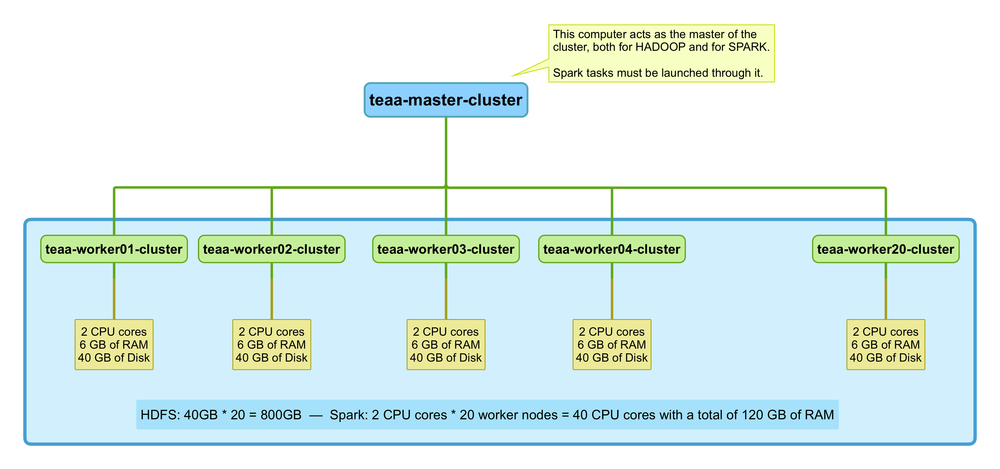
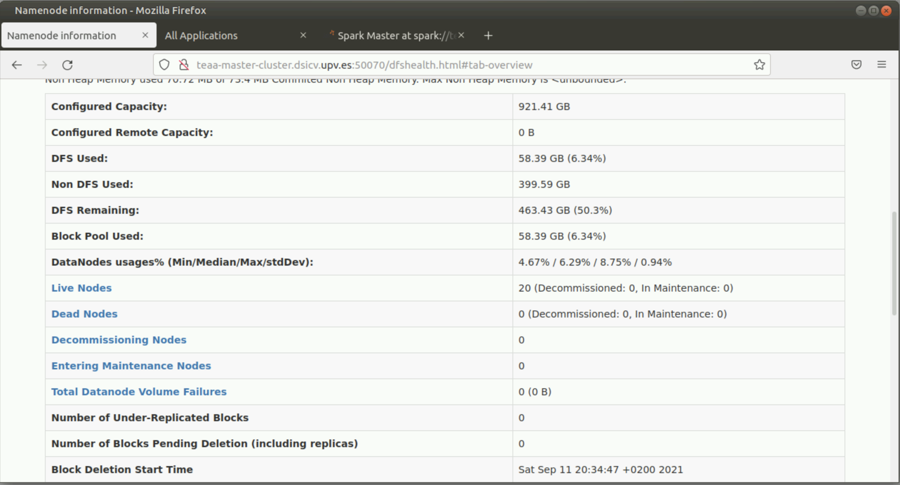
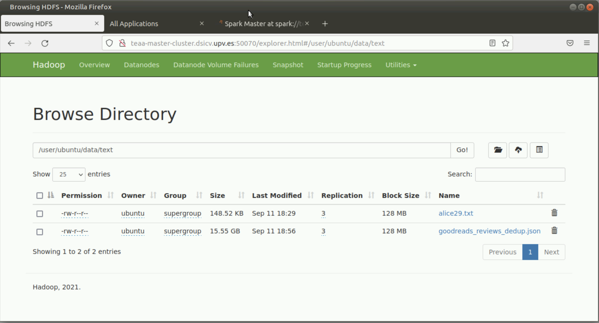
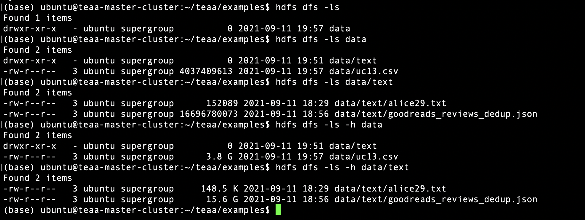
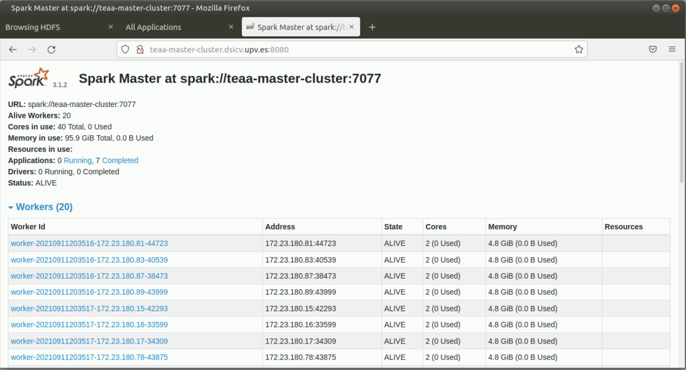
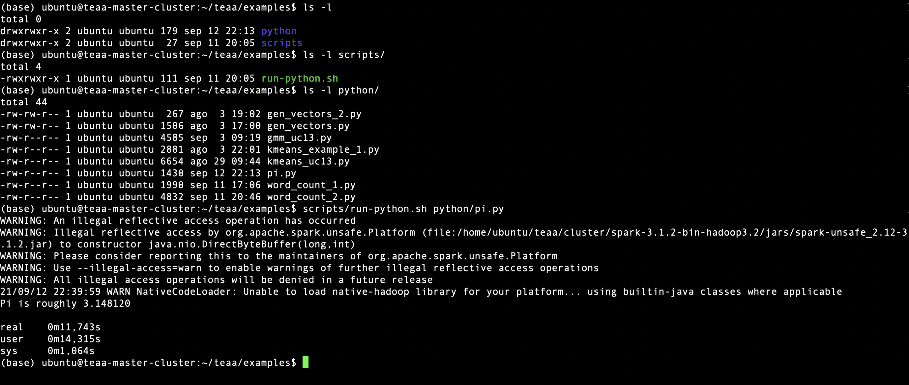

# Environment of TEAA lab

This section is devoted to briefly describe the configuration
of the virtual environment used in the lab practices of this
subject.

The virtual environment is hosted by the
[DSIC](https://www.dsic.upv.es)
of the
[Technical University of Valencia](https://www.upv.es)
through the private cloud service:
[portal-ng](https://portal-ng.dsic.upv.es).

Next figure shows the configuration of the cluster:

Students can access to 
[portal-ng](https://portal-ng.dsic.upv.es)
via
[PoliLabs](https://polilabs.upv.es/uds/page/login) 
or directly to when connected from
the **intranet** of the UPV, i.e., **UPVNET** or
using a
[virtual private network](http://www.upv.es/contenidos/INFOACCESO/index.html).

From a UNIX terminal once connected to a Linux virtual machine of PoliLabs,
students can connect by using their username and password to the master of
the cluster as follows:

>   
> `ssh  <username>@teaa-master-cluster.dsicv.upv.es`
>   

******
#

## [Hadoop](http://hadoop.apache.org) Distributed File System (HDFS)

Next two figures show the web-based graphical interface 
to monitor and operate with the HDFS.

#

And next figure shows how to interact with the HDFS from the Linux console.
As for the **ls** command in Linux, the option **-h** is used to
print the file sizes in a human readable mode.

******

## [Spark](https://spark.apache.org)

The master machine is the machine all users must use to launch
[Spark](https://spark.apache.org)
tasks.
Tasks can be launched from any of the machines in the cluster
but using the address of the master.

Next figure shows the web-based graphical interface
to monitor the
[Spark](https://spark.apache.org)
cluster and the tasks.
Running tasks can be stopped from this interface.

In the configuration provided, students can find a *shell-script*
to easily launch
[Spark](https://spark.apache.org)
tasks from the command line.
The script is available [here](examples/scripts/run-python.sh).

Next figure shows where the above mentioned *shell-script* 
and [python code used as example](examples/python) is located,
and also shows how a simple example for computing an approximation
to number PI is launched. The code for this example [pi.py](examples/python/pi.py)
and some of the other examples have been extracted from the
[Spark examples](https://spark.apache.org/examples.html).

During the first lab session other
[Spark examples](https://spark.apache.org/examples.html)
will be explained.
